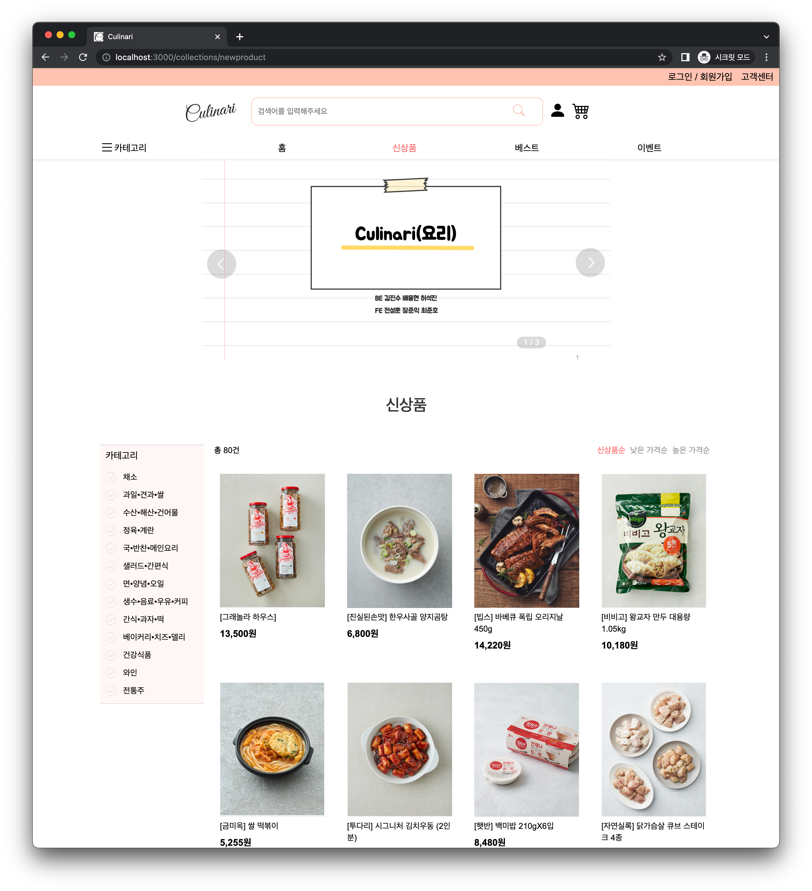
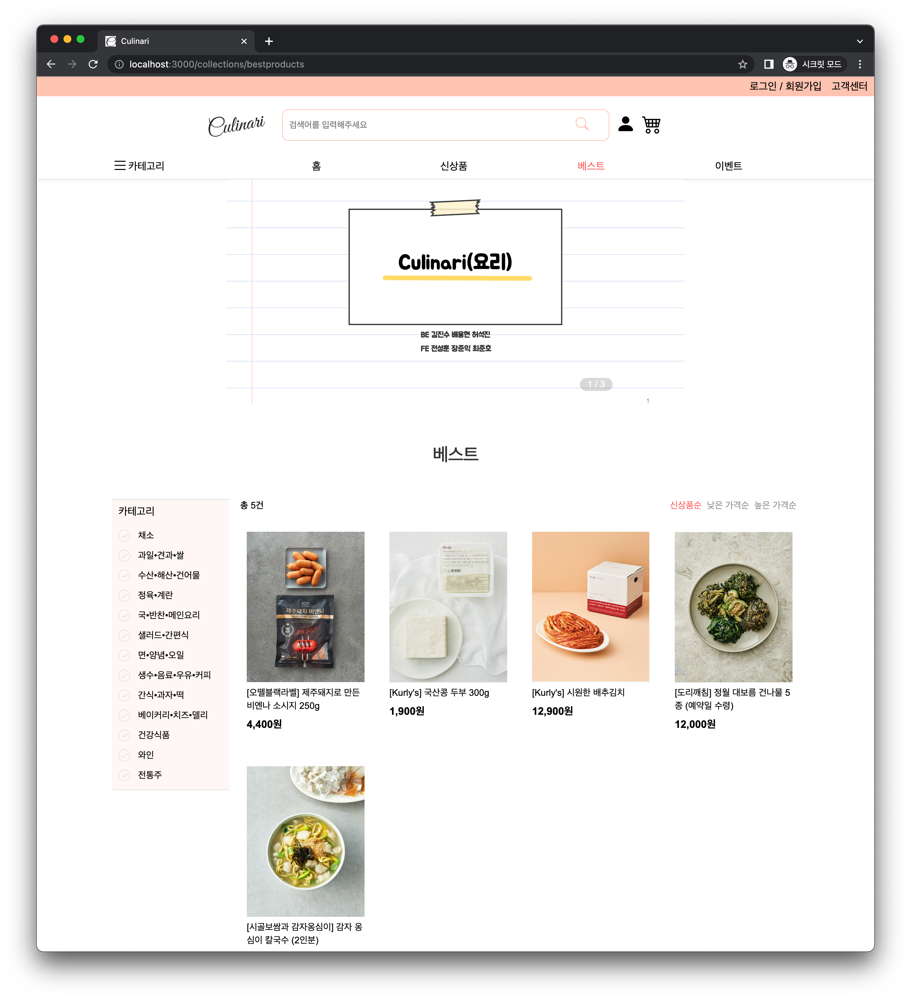
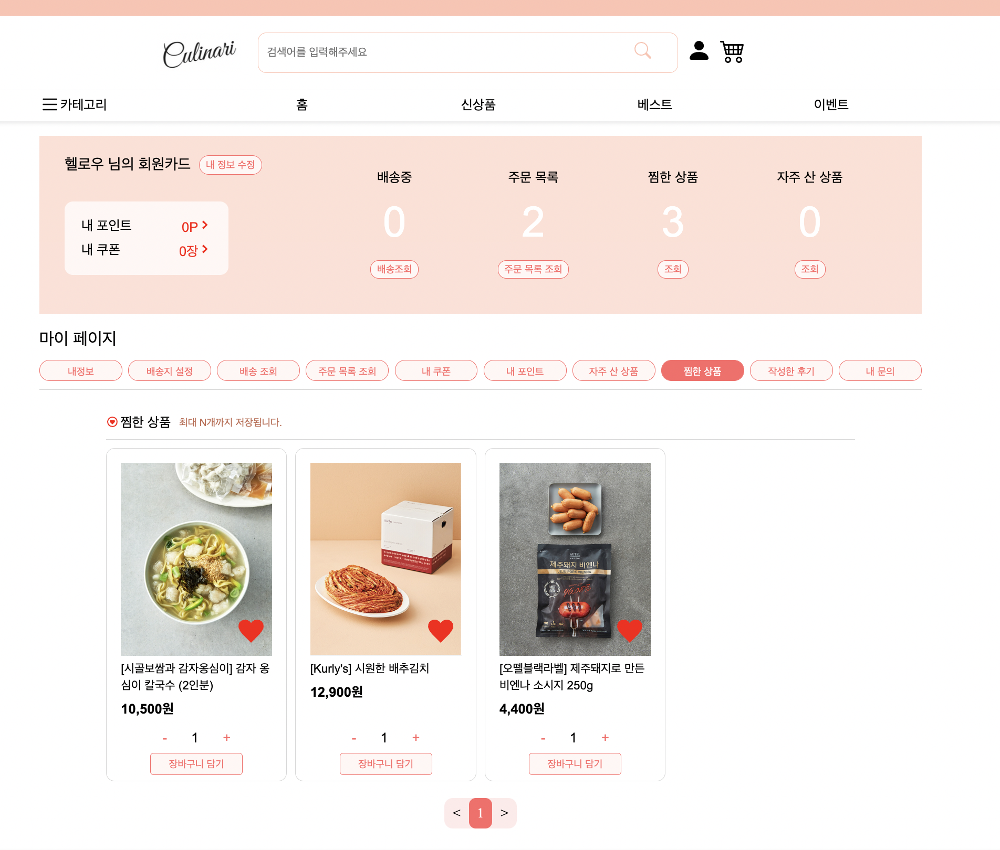
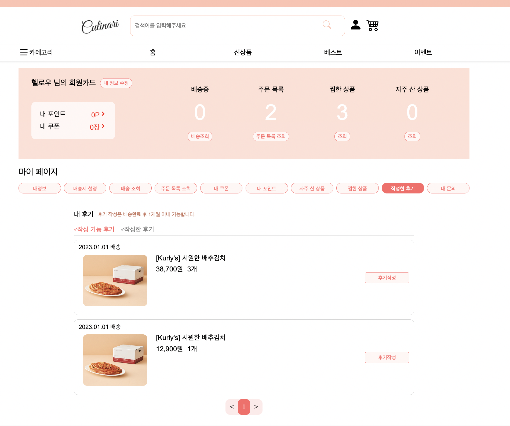
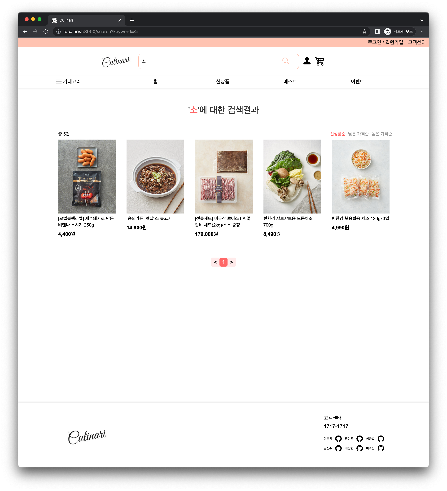

# Culinari 

##  BE 김진수 개발 Part 소개
이 프로젝트는 코드스테이츠 부트캠프 진행 간 마지막의 메인으로 만든 프로젝트입니다.
이커머스 방식의 웹 애플리케이션을 제작하려고 했으며, 거기에 우리의 로직을 얹으려 했으나 이커머스 자체의 사이즈를 너무 크게 잡아 기본에 충실한 프로젝트가 돼버리고 말았습니다,
하지만 많은 점을 배웠기에 기록을 남깁니다.

# Version

## Culinari V1.0.0
## - 상품 및 카테고리 부분 구현
### - 도메인 설계
    1. 도메인 설계 및 구현 방식의 선정
     https://romanc3.tistory.com/45
### - 비지니스 로직 설계
   1. 신상품 페이지네이션

   2. 베스트상품 페이지네이션

    https://romanc3.tistory.com/46
    
   3. 찜한 상품

   4. 리뷰

   5. 통합 검색

    https://romanc3.tistory.com/47

### - 이미지 업로드 구현
    https://romanc3.tistory.com/40
### - Github Action 적용
    https://romanc3.tistory.com/41

### - EC2/RDS 배포 및 서버 관리

## Culinari V2.0.0
 https://github.com/frontLine-kim/Culinari-V2.0.0.git

